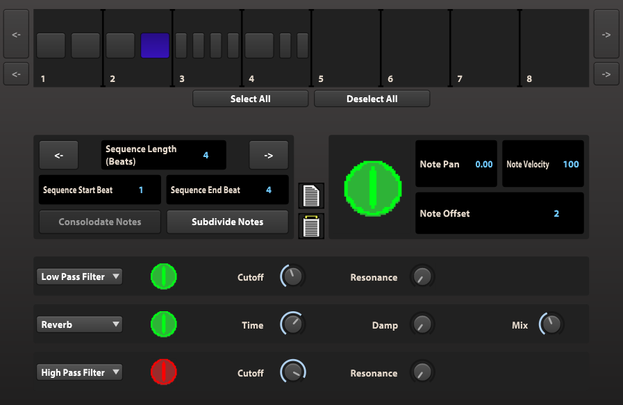
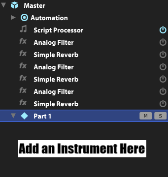
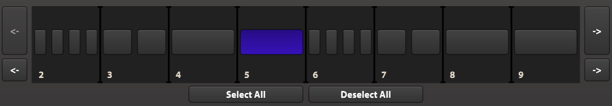
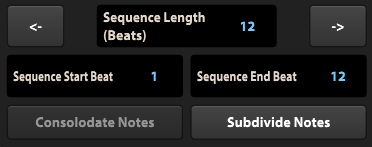
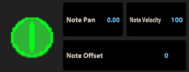
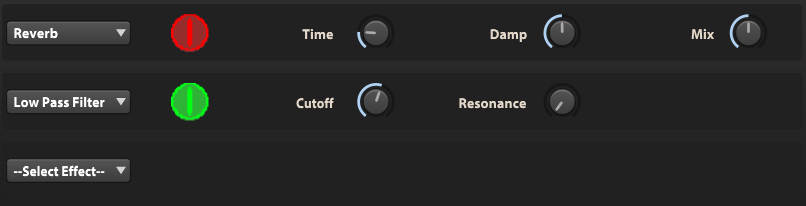
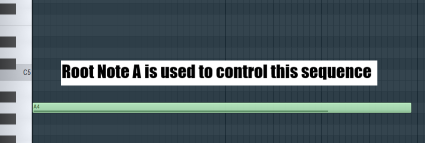

# **filtering-sequencer**

## **Description:**

- **Demo Video:** *Coming soon...*

- An experemental music sequencer created within the synthesizer UVI Falcon. The sequencer operates within the main node of Falcon's tree structure, allowing multiple instruments located on subsequent nodes to be controlled.

- Supports musical sequences up to thirty two beats in length. Beats can be consolodated and subdivided in order to create unique musical progressions.

- Each note of a sequence can be individually controled. Adjustable parameters include note on/off, transpose, panning (not compatable with certain instruments), velocity, and any added effect parameters.

  

## **How to Run:**

- **Purchase UVI Falcon:** Purchase the synthesizer UVI Falcon (Available at: https://www.uvi.net/falcon.html).

- **Clone Repository:** Clone the falcon repository into a directory of your choice.

- **Set Up a MIDI Controller:** Connect UVI Falcon to a MIDI controller.

- **Load Sequencer Multi:** Navigate to the filtering-arpeggiator-template multi located within the cloned repository. Load the multi into UVI Falcon.

- **Add an Instrument to the Sequencer:** Using Falcon's tree visualizer as a reference, add an instrument to the "Part 1" node. To add more instrument to the sequence, create more parts.

  

## **User Manual:**

- **Sequence Navigation and Selection Panel:**

  - **General Description:** The sequence navigation and selection pannel allows the user to efficiently move within a created sequence and select which notes they wish to modify.
 
      

  - **Note Selection:** To select a note, simply click the desired note on the display. Selected notes will be displayed in blue. To deselect a note, click an already selected note on the display. Alternativley, the select all and deselect all buttons can be used to target all notes in the sequence.
 
  - **Navigation Arrow Buttons:** The navigation arrow buttons, pictured to the left and right of the display panel, can be used to navigate to parts of the sequence that are not visible. This is due to the fact that the display panel only shows eight beats at a single time. The smaller arrow buttons move the display one beat in their respective direction. The larger arrow buttons move the display four beats in their respective direction.

- **Sequence Structure Pannel:**

  - **General Description:** The sequence structure pannel is used to arrange sequences in interesting ways through subdivision and consolodation.
 
    

  - **Sequence Length Box:** The sequence length box is used to determine the length of a sequence in beats. When a sequence is extended, single beat default notes are inserted at the end. When a sequence is shortened, notes are removed from the end of the sequence. During removal, any notes that cross a beat marker are truncated.
 
  - **Sequence Start and End Boxes:** The sequence start box can be used to the modify the sequencer's starting point in beats. For example, if the sequence start box has a value of two, the sequencer will start playing from beat two of the sequence. Similarly, the sequence end box can be used to modify the sequencer's ending point in beats.
 
  - **Consolodate Notes Button:** The consolodate notes button will combine a consecutive series of selected notes into a single note. Note that selected notes must be consecutive in order for the button to activate. The maximum length of consolodated notes is two beats.
 
  - **Subdivide Notes Button:** The subdivide notes button can be used to break selected notes into smaller parts. Note that the smallest supported subdivision is sixteenth notes, and all subdivisions are multiples of four. Selected notes do not have to be consecutive, however, the largest possible subdivision is dependedent on the smallest selected note.
 
  - **Note Order Arrow Buttons:** The note order arrow buttons, pictured at the top left and top right of the structure pannel, can be used to modify the position of a consecutive series of selected notes. For example, using the right arrow button will swap a series of consecutive notes with the note to their immediate right. These buttons are helpful when rearranging the notes of a sequence.
 
- **Note Modification Panel:**

  - **General Description:** The note modification panel can be used modify the parameters of individual notes. It is important to note that adjusted parameters are applied to all selected notes.

    

  - **Note On/Off:** The green button is the note on/off button. When turned off, affected notes are not played by the sequencer.

  - **Note Pan:** The note pan box allows notes to be adjusted left or right within the stereo field. A value of 1.00 corresponds to hard right and a value of -1.00 corresponds to hard left. It is important ot note, after testing, it seems the note pan feature is incompatible with many prebuilt Falcon instruments.

  - **Note Velocity:** The velocity box can be used to control performance related elements of different simulated instruments. This typically corresponds to how soft or loud a note is played.

  - **Note Offset Box:** The note offset box determines how far in steps a note is from the root of the sequence. The range is two octaves above and bellow the root.

- **Effect Panels:**

  - **General Description:** The effect panels can be used to add basic effects to the sequence. Similar to the note modification pannel, effect parameters can be adjusted individually with respect to different notes. Effects are applied from the top down, meaning that the top effect is applied first.

    

- **Root Note Selection:**

  - **MIDI:** The sequencer uses MIDI input to determine the root note of the sequence. This means that the sequencer will only play when it receives MIDI input, and all notes played are based on the MIDI note detected. You can send the sequencer multiple MIDI notes at a time, however, this is not the sequencer's intended use. When multiple notes are sent to the sequencer, unpredictable sequences occor due to conflicting effect changes. It can be interesting to experement with this unintended feature.
 
    

## **Project Reflection:**

  - **My Experience:** I enjoyed both creating and using this utility. During the creation process, I gained a basic understanding of scripting within UVI Falcon and applied my computer science knowledge to a unique project. Once I finalized the sequencer, I was able to produce unique music that I wouldn't have been inspired to create otherwise.
  
  - **Future Improvements:** One problem that I noticed with this sequencer is a harsh clicking sound that sometimes occurs when notes are changed. This is due to different effect settings on different notes and the sequencer's lack of smoothing. While this side effect is problematic, it also leads to the creation of interesting artifacts which can be musically significant. Because of this, I would like to add an adjustable smoothing feature in the future. 
